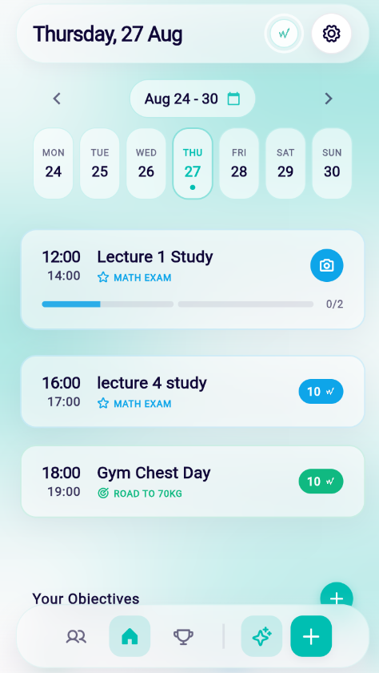
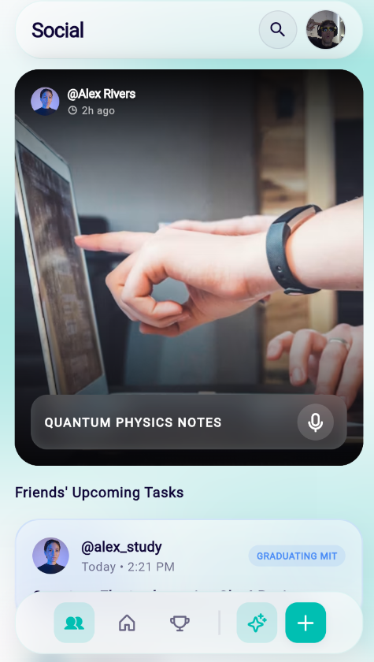
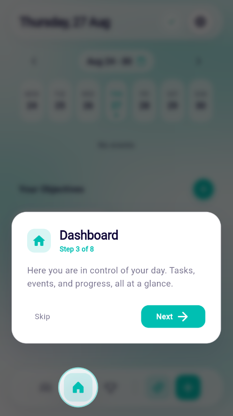
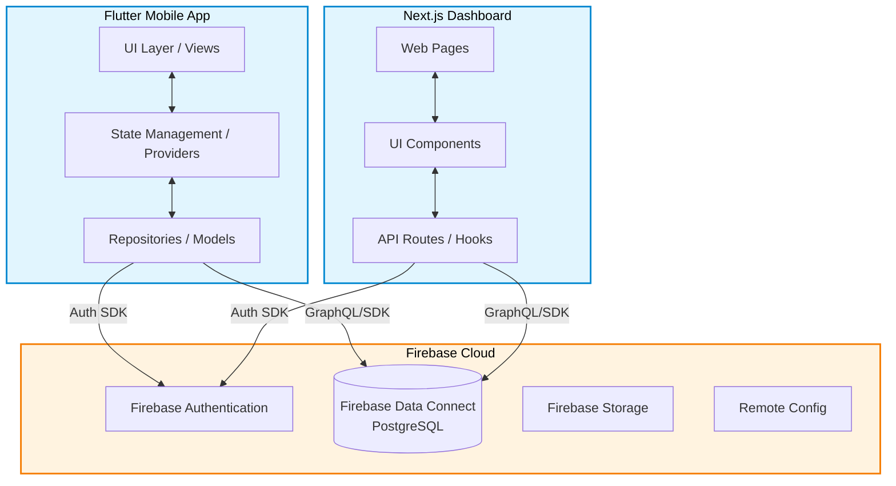
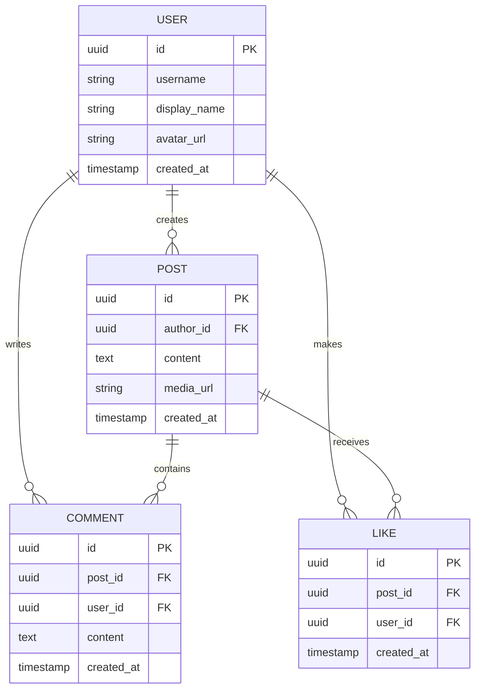

  
  <h1>WillApp: Social Productivity Platform</h1>
  
<strong>Turn your ambition into daily habits. Verify with AI. Share with your circle.</strong>

  
A gamified productivity & study roadmap engine that turns high-stakes goals into daily milestones and verifies task completion with multimodal AI photo inspection.

> **Note:** This is a showcase repository. The source code for WillApp is proprietary. This repository provides an architectural overview of the technologies, multimodal AI pipelines, and technical systems engineered for the platform.

## 📱 Screenshots

  
  
  

## 💡 The WillApp Engine & Architecture

* **Structured Goal Decomposition ("Wills"):** Converts ambitious academic and lifestyle milestones into manageable daily micro-tasks mapped against target completion deadlines.
* **Multimodal AI Verification Pipeline:** Evaluates user-submitted photographic proof (e.g. solved STEM problem sets, active study setups, gym logs) using the **Gemini Multimodal API**, verifying task authenticity with structured validation schemas before awarding streak progress.
* **Tamper-Resistant Anti-Cheat Telemetry:** Tasks are server-validated against EXIF metadata, timestamp boundaries, and repetition heuristics to preserve streak integrity.
* **Social Accountability & Cohorts:** Real-time XP reward mechanics, streak momentum loops, and private cohort feeds for mutual accountability.

## 🛠 Tech Stack

WillApp leverages a modern, robust, and scalable technology stack spanning mobile and web ecosystems:

### Mobile Application
* **Framework:** Flutter
* **Language:** Dart
* **State Management:** Riverpod (for responsive, scalable state orchestration)
* **Local Storage:** Secure storage for caching and tokens
* **Localization:** AppLocalizations (l10n) for multilingual support (English, Spanish, French)

### Web Dashboard & Landing Page
* **Link:** [willapp.es](https://willapp.es)
* **Framework:** Next.js (React)
* **Styling:** Tailwind CSS + custom Design Tokens (AppColors, AppSpacing)
* **Animations:** Framer Motion (for premium microinteractions and layout transitions)
* **UI Components:** shadcn/ui & Radix UI

### Backend & Cloud Services
* **Database:** Firebase Data Connect (PostgreSQL backend with relational integrity)
* **Authentication:** Firebase Auth
* **App Hosting:** Firebase App Hosting for the web platform
* **Analytics & Stability:** Firebase Crashlytics & Remote Config
* **Storage:** Firebase Storage (for AI task verification photos and audio reactions)

## 📐 Architecture Overview

### High Level System Architecture
The application follows a clean, decoupled architecture separating the client side logic from the cloud infrastructure.

### Relational Database Schema (Firebase Data Connect)
WillApp utilizes a robust relational model to handle social connections and complex user data structures seamlessly.

## 🧠 Challenges & Solutions

### 1. Architecting the Firebase SQL Backend (Data Connect)
**Challenge:** WillApp required complex, highly relational data queries (e.g., fetching a user's feed along with the nested comments, like counts, and author details in a single pass). Traditional NoSQL document structures in Firestore would have required excessive client side joins and high read counts, leading to performance bottlenecks and increased costs.

**Solution:** We adopted **Firebase Data Connect**, powered by PostgreSQL. By designing a strict relational schema and utilizing GraphQL for our queries, we were able to offload the heavy joining logic to the database layer. This drastically reduced network payload sizes and simplified the client side repository layer, ensuring a snappy feed experience even on slower mobile networks.

### 2. Optimizing State Management for Deep Widget Trees
**Challenge:** The mobile application features a highly interactive UI with nested components, glassmorphic overlays, and real time updates. Initially, relying on standard `setState` or simple inherited widgets caused unnecessary rebuilds of large widget trees, leading to frame drops during animations and scrolling.

**Solution:** We implemented **Riverpod** to heavily decouple the business logic from the UI. By extracting large widget trees into smaller, private `StatelessWidget` and `StatefulWidget` classes, and carefully scoping provider watchers (`ref.watch`) to only the granular widgets that needed the data, we minimized unnecessary rebuilds. This resulted in a consistent 60 FPS performance, keeping the app smooth.

### 3. Building Complex, Premium Animations on the Web
**Challenge:** The brand identity of WillApp relies on premium aesthetics, specifically "Liquid Glass" effects, ambient orbs, and seamless transitions on the web dashboard. Achieving these microinteractions without causing layout thrashing or draining the user's battery was difficult using standard CSS transitions.

**Solution:** We leveraged **Framer Motion** within the Next.js ecosystem. By using hardware accelerated properties (`transform` and `opacity`) and Framer Motion's `AnimatePresence` for route transitions, we created fluid, organic animations. We also structured the UI with a strict design system relying on Tailwind CSS tokens (`AppColors`, `AppSpacing`), ensuring that all complex components (like glassmorphism panels) remained accessible, performant, and consistent across the entire platform.

## 🌟 Open Source Contributions

As part of the WillApp development process, we extracted our highly customized, premium glassmorphism UI components into an open source Flutter package. 

You can check out our reusable **[Flutter Glass Navigation](https://github.com/brunoramirez/flutter-glass-navigation)** repository, which features:
* `GlassAppBar`: A frosted glass app bar with an expanding search body.
* `GlassBottomNavBar`: A floating, glassmorphic bottom navigation bar with fluid, hardware accelerated microinteractions.

---
*Built with passion by the WillApp team.*

